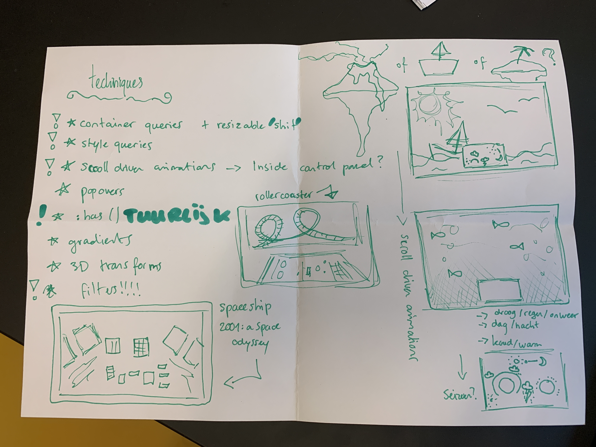
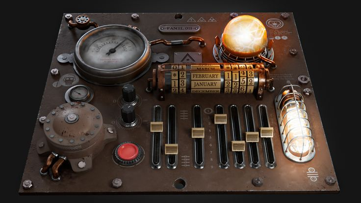
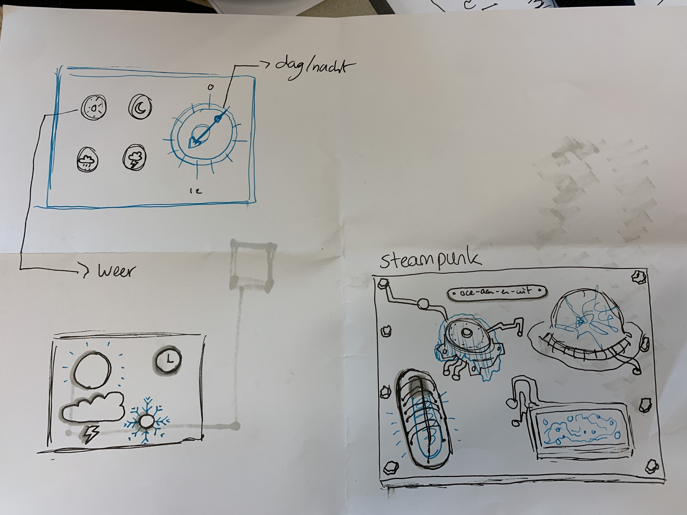

# oce-aan-en-uit

welkom bij dit project voor het vak CSS to the rescue.

## install guide

je hoeft helemaal niets te doen! dit project is alleen met HTML en CSS gebouwd. :D

## proces

### week 1

concept(en) bedacht:

ik kon de 'vibe' van mijn control panel niet zo goed bepalen. ik vond dit control panel toen na een tijdje zoeken als inspiratie en maakte de laatste schets.

## bronnenlijst

- https://www.w3schools.com/tags/att_form_action.asp
- https://blog.logrocket.com/native-css-nesting/
- https://developer.mozilla.org/en-US/docs/Web/CSS/Using_CSS_custom_properties
- https://www.w3schools.com/howto/howto_css_custom_checkbox.asp
- https://www.w3schools.com/cssref/css_colors.php
- https://codepen.io/t_afif/pen/dyOdNvW?editors=1100
- https://blog.logrocket.com/using-property-loosely-typed-css-custom-properties/
- https://bugzilla.mozilla.org/show_bug.cgi?id=28657
- https://stackoverflow.com/questions/10645552/is-it-possible-to-use-an-input-value-attribute-as-a-css-selector
- https://developer.mozilla.org/en-US/docs/Web/CSS/transform
- https://developer.mozilla.org/en-US/docs/Web/CSS/gradient/linear-gradient
- https://bennettfeely.com/clippy/
- https://developer.mozilla.org/en-US/docs/Web/CSS/border-image
