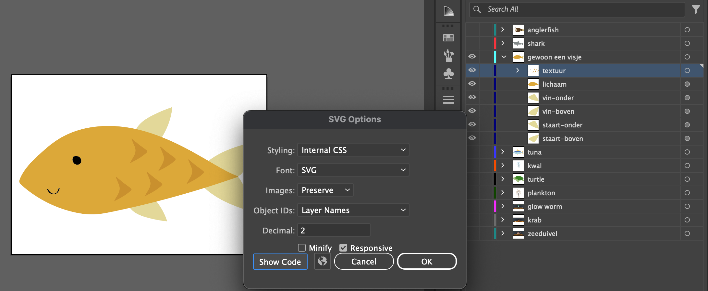

# oce-aan-en-uit

welkom bij dit project voor het vak CSS to the rescue. ik heb ervoor gekozen om een control panel te bouwen om het weer te veranderen ☀️

## workshops

ik heb mijn best gedaan om zo nu en dan een workshopje bij te wonen, dit is wat ik er van opgeschreven heb.

## proces + screenshots

### week 1

concept(en) bedacht:

ik kon de 'vibe' van mijn control panel niet zo goed bepalen. ik vond dit control panel toen na een tijdje zoeken als inspiratie en maakte de laatste schets.

ik ben begonnen met het uitwerken van het control panel. dit is hoe dat er ongeveer uit zag na een paar uur.

de controls had ik gemaakt met een eindeloze gradient, ik heb dit later veranderd naar een background repeat, dit was cleaner en cooler maar was nog niet echt bekend met background shenanigans.

het rastertje duurde vooral eventjes om uit te vogelen, ik wilde dit een soort 3d effect geven en heb dit gemaakt met spannetjes met pseudoclasses met transform skew.

### week 2

het is boot-week! deze week zijn de boten in de aanbieding voor maar 200 regels CSS.

ik begon met het maken van het bootje en ik moest even stoeien en schelden met de container die resizable moest zijn, het ging niet zoals ik wilde maar heb dit uiteindelijk opgelost.

ook heb ik d.m.v. de workshop svg filters elektriciteit kunnen nabootsen (waarvan ik echt dacht: hoe gaat me dat ooit lukken met alleen CSS?). ik ben hier onnodig blij mee.

ik heb EINDELIJK aan de states gewerkt waar mijn control panel controle over heeft, de regen heb ik obv via Sanne the GOAT gefikst, verder gewoon beetje kleurtjes en transforms aangepast.

dit is de css structuur waar ik voor ben gegaan, ik heb geen idee of het een goede manier is maar it made sense to me dus het zal wel los lopen.

waar ik nu wel echt heel blij mee ben is het gebruik van custom properties. ik heb het idee dat alles een beeeeetje op zijn plek begint te vallen in mijn hoofd als het om CSS gaat.

dit ga ik dit weekend en volgende week doen. het is nu midden in de nacht en ik kan niet stoppen met hierover na te denken. help.

### week 3

ik ben begonnen met schetsen wat ik deze week sowieso wil visualiseren, t lijkt me cool als het schip gaat veranderen in een piratenschip als het heel groot wordt. ook moet ik nog iets voor de vriesknop bedenken.

en dit zijn mijn schetsen voor het zeeleven. ik wil nog meer diepzee vissen.

svg's zijn messy as hell

meerdere states ??? leuk.

Ik wilde eigenlijk van die ringetjes onder mijn bootje die dan zouden bewegen, ik heb een paar dingen geprobeerd maar uiteindelijk een radial gradient met background size geanimeerd.

Deze lucht was vele malen indrukwekkender dan de lucht die ik op dag 1 had gemaakt, dus ik heb er (nogal directe) inspiratie van genomen en een beetje geklooid met weerspiegeling.

dit is hoe de states er uiteindelijk uit zien na wat gekloot

### week 4

snowflake is stom. ik snap t niet.

titel = echt een tragedie.

## eindresultaat

het is klaar, maar niet omdat ik vind dat het klaar is maar omdat het vak is afgelopen. ja ach. is niet anders. dit zijn de screenshots.

### waar ik trots op ben:

- dat alles gemaakt is van pure CSS, behalve de svg's maar dat was niet uit luiheid maar gewoon een gebrek aan tijd (en daar heb ik uiteindelijk vet veel van geleerd, ik had nooit eerder met svg's gewerkt)
- de blobs bij het titelscherm, ook al stijgt mijn laptop ervan op
- container query bootje is leuk
- de sneeuwpop met flubber armpjes
- de gradients voor de zee en de lucht, ook al heb ik het idee gejat, ik vind vooral de freezing state erg esthetisch.

### wat ik nog zou doen als deze opdracht nog een week zou duren:

- code netter maken. ik kan het gewoon niet in 1 keer netjes schrijven. het is te veel en ik ben te chaotisch.
- piratenschip
- iets van een anker of een zeemijn die on scroll een vis vermoordt
- de wolken mooier maken
- meer functionaliteiten? het zou ook wel echt cool zijn om bijv de zon van positie te kunnen veranderen met een slider en dat de lucht dan ook dynamisch meeverandert qua positie en kleur.
- marsmannetje
- betere responsiveness, als je nu op klein scherm kijkt verspringt het een en ander.
- mooiere vis animaties, ik heb er nu maar 2 geanimeerd omdat het echt een pain in the ass was

### wat ik geleerd heb

(als je concreet wil weten wat ik heb geleerd dan moet je maar naar de workshop screenshots kijken.)

ik vond vooral de talks van julia en vasilis heel inspirerend. zij is echt een meester van haar medium geworden, ik had nooit gedacht dat je op die manier kon animeren met css. ik vond het echt een eer dat zij kwam spreken bij ons. dankzij haar heb ik nu een sneeuwman met flubber armpjes.

vasilis maakte mij gewoon erg blij met zijn useless design praktijken. om maar gewoon ergens mee te beginnen en te zien waar het schip strandt, zoals een onleesbare abstracte css klok die hij dan ook op de een of andere manier in zijn huis weet op te hangen als fysiek werk. ik snap heel goed dat hij daar gelukkig van wordt. het is zo weird maar zo goed. hij is de meester van 'trust the process', waar ik nog veel van kan/wil leren.

ik maak zelf al onzinnige kunstdingetjes sinds ik een kwast kon vasthouden, maar ben onbewust altijd op zoek geweest naar een medium dat me echt op een andere manier aansprak. toen ik net begon met coderen zag ik de 'beperkingen' van css t.o.v. andere digital design tools ook echt als zeer frustrerende beperking, maar ik heb dat wel anders leren zien. dat het juist heel leuk is om te puzzelen met hoe ver je out of the box kan denken met css, en dat die beperkingen gewoon de kaders van je canvas zijn.

en voor de hoge heren van cmd amsterdam: vervang inleiding programmeren met spelen met css! zonder dat vak had ik hier nooit een passie voor gekregen. en het is niet eens een verplicht vak. dat is heel erg dom en stom.

nou, dat was het!!!

groet

eva

## bronnenlijst

- https://www.w3schools.com/tags/att_form_action.asp
- https://blog.logrocket.com/native-css-nesting/
- https://developer.mozilla.org/en-US/docs/Web/CSS/Using_CSS_custom_properties
- https://www.w3schools.com/howto/howto_css_custom_checkbox.asp
- https://www.w3schools.com/cssref/css_colors.php
- https://codepen.io/t_afif/pen/dyOdNvW?editors=1100
- https://blog.logrocket.com/using-property-loosely-typed-css-custom-properties/
- https://bugzilla.mozilla.org/show_bug.cgi?id=28657
- https://stackoverflow.com/questions/10645552/is-it-possible-to-use-an-input-value-attribute-as-a-css-selector
- https://developer.mozilla.org/en-US/docs/Web/CSS/transform
- https://developer.mozilla.org/en-US/docs/Web/CSS/gradient/linear-gradient
- https://bennettfeely.com/clippy/
- https://developer.mozilla.org/en-US/docs/Web/CSS/border-image
- https://developer.mozilla.org/en-US/docs/Web/CSS/filter
- https://codepen.io/gayane-gasparyan/pen/yLqjVWb
- https://developer.mozilla.org/en-US/docs/Web/CSS/resize
- https://cmda-minor-web.github.io/css-to-the-rescue-2324/samples.html
- https://coder-coder.com/z-index-isnt-working/
- https://www.w3schools.com/css/css3_3dtransforms.asp
- https://developer.mozilla.org/en-US/docs/Web/CSS/border
- https://codepen.io/shooft/pen/MWbmWEq?editors=0100
- https://codepen.io/shooft/pen/wvoJmxy?editors=1000
- https://codepen.io/sashtown/pen/ndOqyb?editors=1100
- https://stackoverflow.com/questions/8947106/css3-transforms-multiple-origins
- https://developer.mozilla.org/en-US/docs/Web/CSS/backdrop-filter
- https://developer.mozilla.org/en-US/docs/Web/CSS/transform-origin
- https://www.w3schools.com/cssref/css_animatable.php
- https://www.w3schools.com/howto/howto_css_flip_image.asp
- https://www.digitalocean.com/community/tutorials/how-to-change-a-css-background-images-opacity
- https://stackoverflow.com/questions/39655289/css-based-on-data-name
- https://www.transparenttextures.com/wood-pattern.html
- https://en.wikipedia.org/wiki/DCI-P3
- https://jenkov.com/tutorials/svg/use-element.html
- https://codepen.io/shooft/pen/MWRyqNy
- https://stackoverflow.com/questions/3859101/what-does-ahref-do-in-css
- https://developer.mozilla.org/en-US/docs/Web/CSS/animation-play-state?retiredLocale=nl
- https://www.w3schools.com/cssref/sel_nth-last-child.php
- https://stackoverflow.com/questions/23367345/100vw-causing-horizontal-overflow-but-only-if-more-than-one
- https://developer.mozilla.org/en-US/docs/Web/CSS/mix-blend-mode
- https://developer.mozilla.org/en-US/docs/Web/CSS/background-size
- https://developer.mozilla.org/en-US/docs/Web/CSS/color_value/color-mix
- https://css-tricks.com/the-shapes-of-css/
- https://developer.mozilla.org/en-US/docs/Web/HTML/Global_attributes/tabindex?retiredLocale=nl
- https://stackoverflow.com/questions/42981485/proper-accessibility-or-aria-role-for-a-resize-handle
- https://stackoverflow.com/questions/23027649/set-background-image-to-cover-according-to-viewport-size

## to do

- kijken naar linear timing function bramus developer.chrome, linear() generator. bouncy stuff. don't know if needed.
- animation-composition cool? animaties combineren?
- kleuren omzetten naar hsl, ff vragen hoe en wat
- illustraties maken voor de dieren: 3 kleine visjes, 2 mid visjes, een schildpad, 2 diepzee vissen (met lampje!!!) en een zeester en een plankton.
- scrolldriven: een anker dat naar beneden zakt, een vis die er door geraakt wordt???? (oke ook anker designen dan want dat ga je nu echt ff niet in css doen maatje)
  een zeemijn???? explosies?!??!?!?!?!!!????!!!!
- ijs knop maken, ik weet echt niet wat voor design
- alien mannetje, astronautje, sneeuwpop ofzo??
- marine snow maken
- zonnig: brouwers pilsie en zonnebril? of zonnig base state?
- css relative color syntax
- de wolken zijn echt lelijk. do better
